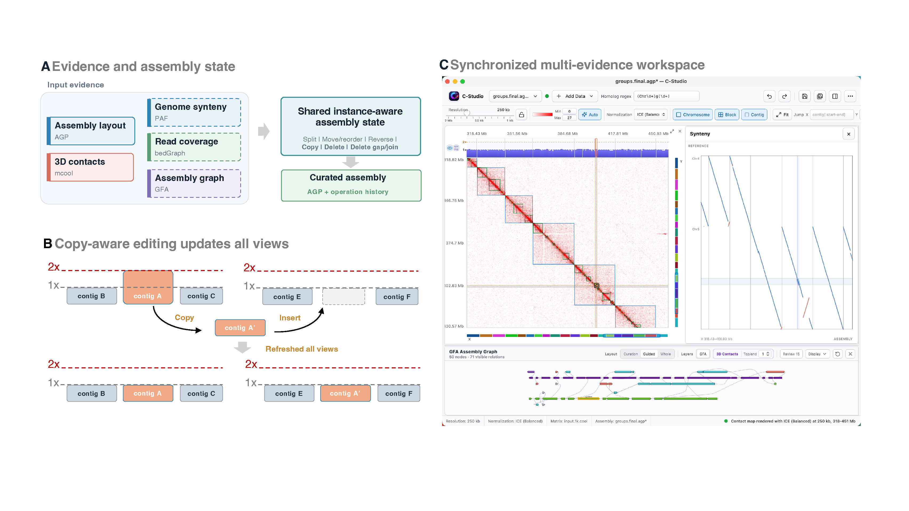

# C-Studio

       [](https://github.com/wangyibin/C-Studio/releases)

> ⚠️ **Development status:** C-Studio is under active development. Features and interfaces may change.

C-Studio is a desktop application for visual inspection and user-directed
editing of chromosome-scale genome assemblies. It brings AGP layouts together
with Hi-C contact maps, synteny alignments, coverage tracks, and assembly-graph
evidence in one synchronized workspace, while keeping the edited AGP layout as
the source of truth.



## Example data

Download [`examples.tar.gz`](https://github.com/wangyibin/C-Studio/releases/download/v0.5.0/examples.tar.gz)
from the [C-Studio v0.5.0 release](https://github.com/wangyibin/C-Studio/releases/tag/v0.5.0).
Extract the archive, then load an extracted project directory with
**Add Data → Load project folder…**.

The archive contains these example files:

```text
groups.final.agp
alfalfa.mapq1.mcool
alfalfa.coverage.bedgraph
ref.align.paf
alfalfa.p_utg.noseq.gfa
```

## Documentation

- English: [online documentation](https://wangyibin.github.io/C-Studio/latest/)
- 中文：[在线文档](https://wangyibin.github.io/C-Studio/zh/latest/)
