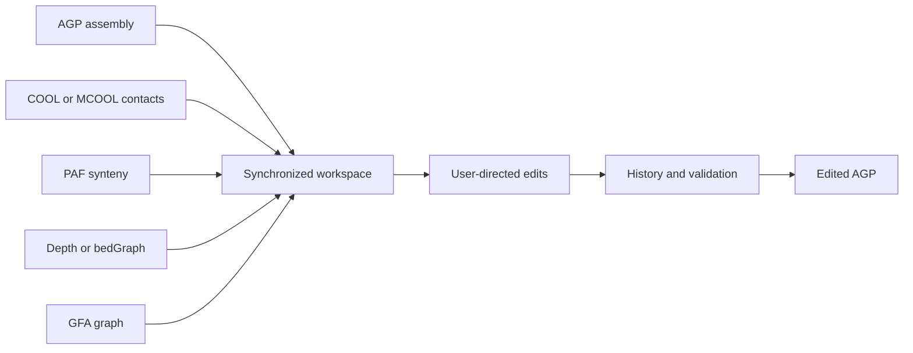

# C-Studio
       
C-Studio is an early-stage desktop application for inspecting chromosome-scale
assemblies, comparing multiple evidence layers, and making user-directed AGP
edits. The current application is built with Tauri 2, React, TypeScript, and
Rust.

!!! important "Current scope"

    This documentation describes the current `0.3.5` implementation. C-Studio
    supports an evidence-guided curation workflow; it does **not** infer the
    biologically correct breakpoint, orientation, group, or copy number for the
    user.

## What C-Studio brings together

- AGP assembly structure and editable contig placements
- `.cool` and `.mcool` contact maps
- PAF synteny alignments
- depth or bedGraph coverage tracks
- GFA assembly topology and optional endpoint-level 3D-contact evidence
- copy-aware selection, editing, history, undo, redo, and AGP export
- compatible operation-history sidecars saved alongside edited AGP files

## Evidence and authority

The currently edited AGP layout is authoritative for ordering, orientation,
boundaries, and export. Contact maps, PAF, coverage, and GFA are evidence views.
They are synchronized with the edited layout but are not silently rewritten or
allowed to decide an edit.

## Start here

1. [Install or build C-Studio](installation.md).
2. [Prepare AGP and evidence files](user-guide/input-preparation.md).
3. Follow the [first project walkthrough](getting-started.md).
4. Review [project file discovery](user-guide/project-data.md) before loading a
   real dataset.
5. Read [assembly editing](user-guide/assembly-editing.md) before enabling
   auto-save or deleting copies.

The [current limitations](reference/limitations.md) page distinguishes working
features from packaging, platform, and validation gaps.
