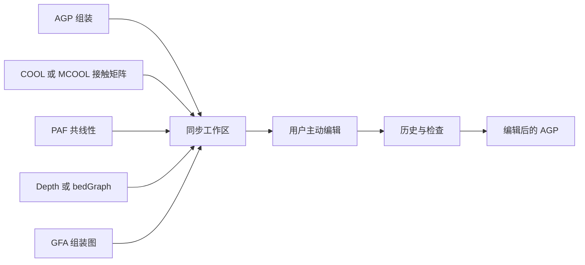

# C-Studio
       

C-Studio 是一个处于早期阶段的桌面应用，用于检查染色体尺度组装、对照多类证据，
并由用户主动编辑 AGP。当前应用由 Tauri 2、React、TypeScript 和 Rust 构建。

!!! important "当前范围"

    本文档描述当前 `0.3.5` 实现。C-Studio 提供证据辅助的校订工作流，
    但**不会**替用户判断生物学上正确的断点、方向、分组或拷贝数。

## C-Studio 汇集的内容

- AGP 组装结构与可编辑的 contig 放置
- `.cool` 和 `.mcool` 接触矩阵
- PAF 共线性比对
- depth 或 bedGraph 覆盖度轨道
- GFA 组装图拓扑及可选的端点级三维接触证据
- 感知拷贝的选择、编辑、历史、撤销、重做和 AGP 导出
- 与编辑后 AGP 一同保存、可兼容恢复的操作历史 sidecar

## 证据与权威来源

当前编辑中的 AGP 布局是排序、方向、边界和导出的权威来源。接触矩阵、PAF、
覆盖度和 GFA 都是证据视图；它们会随编辑后布局同步，但不会被静默改写，也不会
自行决定编辑操作。

## 从这里开始

1. [安装或构建 C-Studio](installation.md)。
2. [准备 AGP 和证据文件](user-guide/input-preparation.md)。
3. 按照[首个项目流程](getting-started.md)操作。
4. 加载真实数据前阅读[项目文件发现规则](user-guide/project-data.md)。
5. 启用自动保存或删除拷贝前阅读[组装编辑](user-guide/assembly-editing.md)。

[当前限制](reference/limitations.md)页面区分了已实现功能与打包、平台和验证缺口。
